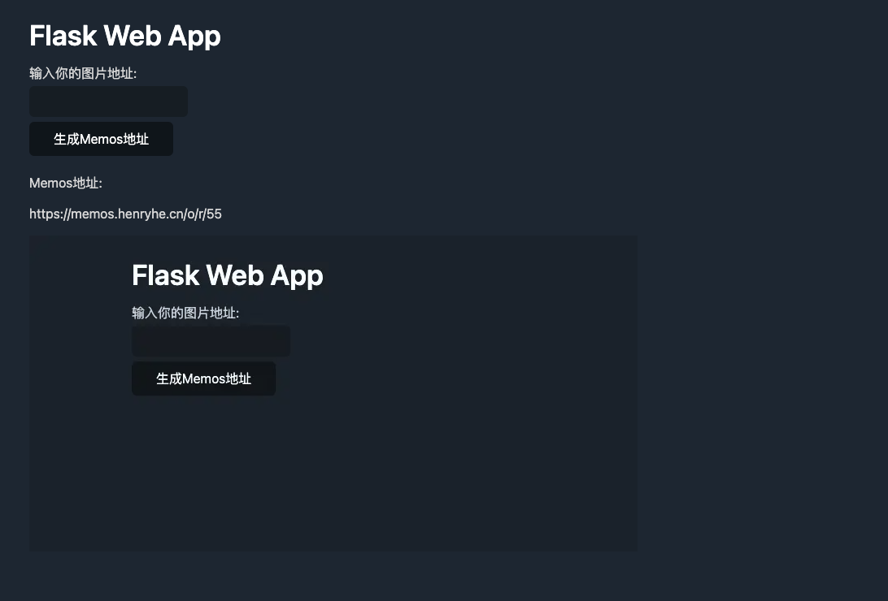

# MemosPicGo
下载给定地址的图片，自动转换格式为webp格式并上传至Memos.

## cwebp转换结果


## 示例日志
```
pic_url is: https://upload-images.jianshu.io/upload_images/1241175-3ffb9015aa085bdd.png?imageMogr2/auto-orient/strip%7CimageView2/2/w/1240
uploads//1241175-3ffb9015aa085bdd.png 1241175-3ffb9015aa085bdd.png
Saving file 'uploads//1241175-3ffb9015aa085bdd.png.webp'
File:      uploads//1241175-3ffb9015aa085bdd.png
Dimension: 748 x 389
Output:    4552 bytes Y-U-V-All-PSNR 55.77 58.97 59.54   56.65 dB
           (0.13 bpp)
block count:  intra4:         84  (7.15%)
              intra16:      1091  (92.85%)
              skipped:      1064  (90.55%)
bytes used:  header:            158  (3.5%)
             mode-partition:    867  (19.0%)
 Residuals bytes  |segment 1|segment 2|segment 3|segment 4|  total
    macroblocks:  |       0%|       1%|       5%|      94%|    1175
      quantizer:  |      36 |      36 |      32 |      25 |
   filter level:  |      11 |       8 |       6 |       4 |
convert to cwebp successfully: uploads//1241175-3ffb9015aa085bdd.png.webp
[]
[55]
[55]

==========================
your pic:
https://memos.henryhe.cn/o/r/55
```

## 结果
